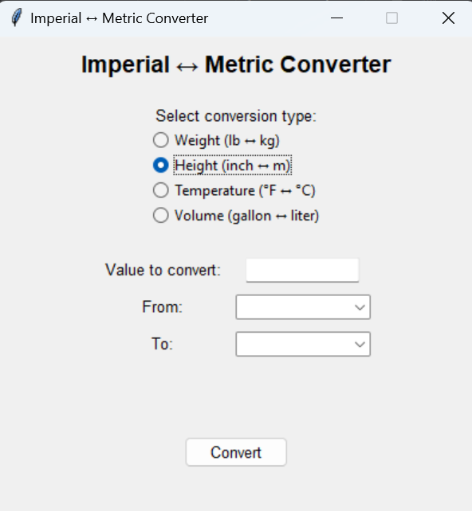

# Imperial ↔ Metric Converter

A simple and elegant GUI application for converting between imperial and metric units, built with Python and Tkinter.

 *(Note: You would add an actual screenshot here)*

## Features

- Convert between four categories of measurements:
  - **Weight**: Pounds (lb) ↔ Kilograms (kg)
  - **Height**: Inches (in) ↔ Meters (m)
  - **Temperature**: Fahrenheit (°F) ↔ Celsius (°C)
  - **Volume**: Gallons (gal) ↔ Liters (L)
- Clean, user-friendly interface
- Dynamic field updates based on conversion type
- Error handling for invalid inputs
- Precise results with 2 decimal places

## Requirements

- Python 3.6+
- Tkinter (usually comes with Python installation)

## Installation

1. Clone the repository:
   ```bash
   git clone https://github.com/yourusername/imperial-metric-converter.git

## Usage

1. Run the application with:
    ```bash
    python main.py
